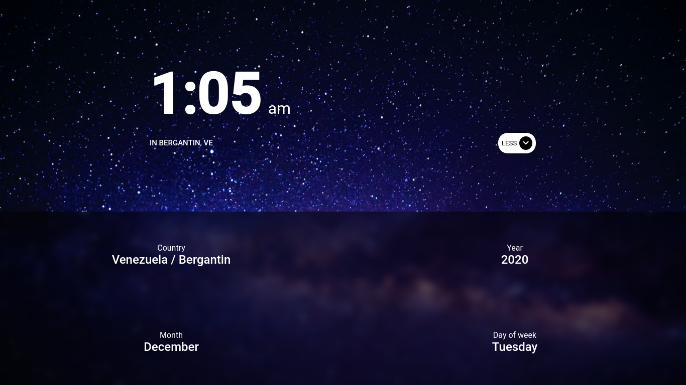

# Chronos 

A clock made in vue (version 3) using the composition api



## Clone repository

```bash
~$ git clone https://github.com/j-mora15/chronos.git
```

## Download dependencies

```bash
~$ yarn
```

## Build

```bash
~$ yarn build
```

## Run Development

```bash
~$ yarn dev
```
